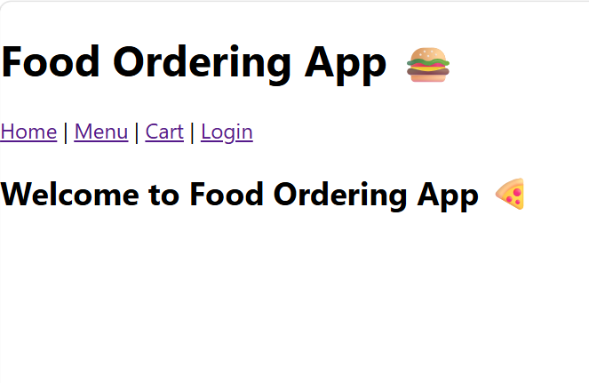
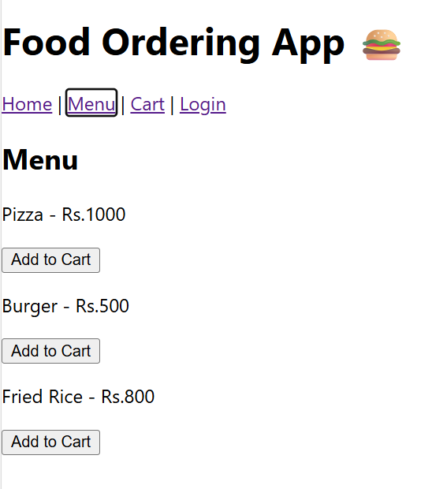
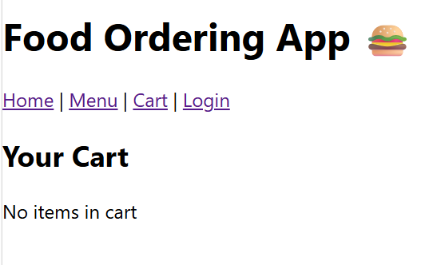
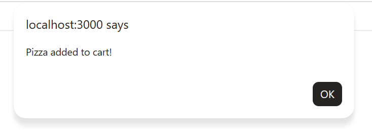
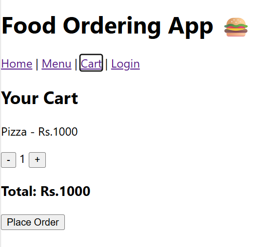
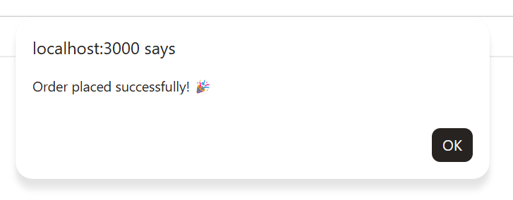
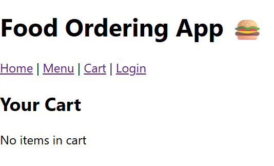

# 🍔 Food Ordering Frontend App

## 📌 Description
This is a frontend web application developed using React with TypeScript.  
It allows users to browse food items, add them to the cart, manage quantities, and place orders.

## 🚀 Features
- View food menu
- Add items to cart
- Remove items from cart
- Update item quantity
- Calculate total price
- Place order

## 🛠️ Technologies Used
- React (TypeScript)
- React Router
- Local Storage

## ▶️ How to Run
```bash
npm install
npm start

## 📸 Screenshots

### 🏠 Home Page


### 🍔 Menu Page


### 🛒 Empty Cart


### ➕ Add Item to Cart


### 🛒 Cart with Item


### 📦 Order Placed


### 🧹 Cart After Order

